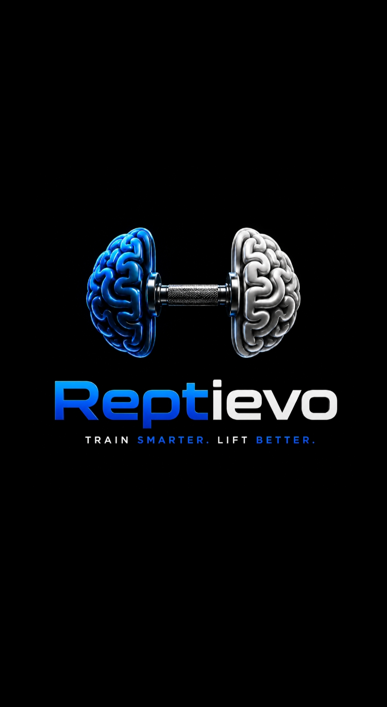

<p align="center">
  
</p>

<h1 align="center">Reptievo</h1>

<p align="center">
<b>Train Smarter. Lift Better.</b>
</p>

<p align="center">
Smart fitness companion built with Python, Kotlin, Supabase and AWS.
</p>

<p align="center">
<a href="https://play.google.com/store/apps/details?id=com.ramazanyuksel.liftiq">

</a>
</p>

<p align="center">
📱 <b>Available now on Google Play:</b>
<a href="https://play.google.com/store/apps/details?id=com.ramazanyuksel.liftiq">play.google.com/store/apps/details?id=com.ramazanyuksel.liftiq</a>
</p>

<p align="center">
<b>LinkedIn Company Page</b>
</p>

<p align="center">
<a href="https://www.linkedin.com/company/reptievo/?viewAsMember=true">linkedin.com/company/reptievo</a>
</p>

---

# Overview

Reptievo is a fitness assistant designed to remove the guesswork from strength training. Instead of manually calculating calories, protein intake, workout progression, and training volume, Reptievo automatically generates personalized workout plans and nutrition targets using a modern backend architecture.

The application combines native Android development with intelligent backend services to deliver a complete, end-to-end fitness companion — from onboarding to daily training to long-term progression.

---

## 📱 Screenshots

<p align="center">
  
  
  
  
  
</p>

<p align="center">
<i>Dashboard · Weekly Plan · Workout History · Stats · Cardio Logging</i>
</p>

---

## ✨ Features

### 🧭 Smart Onboarding

* Personalized user profile
* Body measurements (height, weight, age)
* Goal selection (bulk, cut, maintain)
* Experience level (beginner → advanced)
* Activity level

### 🍎 Nutrition Calculator

Automatically calculates:

* BMR (Basal Metabolic Rate)
* TDEE (Total Daily Energy Expenditure)
* Daily calorie target

### 🏋️ Intelligent Workout Planning

* Personalized weekly workout plans
* Beginner / Intermediate / Advanced support
* Equipment-aware weight generation
* Science-based exercise ratios

### 📈 Progressive Overload

Reptievo automatically adjusts training intensity based on:

* RPE (Rate of Perceived Exertion) score
* Previous workout performance
* Weight progression over time
* Full performance history

### 📝 Workout Tracking

Track every session in detail:

* Exercises
* Sets & repetitions
* Weight
* RPE

### 🏃 Cardio Tracking

Log cardio sessions with MET-based calorie calculations:

* Treadmill walking & running (speed and incline aware)
* Stationary bike
* Elliptical, stair climber, and rowing machine
* Automatic calorie burn calculation based on body weight and duration

### 🔧 Workout Customization

* Reorder exercises
* Override weights and sets
* Swap exercises for alternatives
* Add or remove exercises from any day
* Real-time synchronization with the backend

### 🌙 Recovery Detection

If no workout is scheduled for today, Reptievo automatically displays a Recovery Day, encouraging rest as part of the training cycle.

---

## 🛠 Tech Stack

**Android**

* Kotlin
* Jetpack Compose
* Material 3
* Retrofit
* Coroutines
* DataStore

**Backend**

* Python
* FastAPI
* PostgreSQL
* Supabase (Auth + Database)

**Infrastructure**

* AWS EC2
* Brevo (transactional email)
* GitHub Actions (CI/CD — automated deployment on every push to main)

---

## 🏗 Architecture

```
Android App (Kotlin / Jetpack Compose)
              │
              ▼
     REST API (FastAPI)
              │
              ▼
   Supabase (Auth + PostgreSQL)
```

---

## ✅ Current Features

* Authentication & email verification
* User onboarding
* Nutrition calculator
* Baseline workout generator
* Progressive overload engine
* Cardio tracking with calorie calculation
* Workout history
* Exercise overrides & swaps
* Recovery day detection
* Profile management
* Automated CI/CD deployment

## 🔮 Planned Features

* PR tracking
* Workout analytics
* AI workout coach
* Smart recovery suggestions
* Apple Health integration
* Google Fit integration
* Wear OS support
* Push notifications
* Dark theme improvements

---

## 📄 Legal

* [Privacy Policy](./PRIVACY_POLICY.md)
* [Terms & Conditions](./TERMS_AND_CONDITIONS.md)
* [License](./LICENSE) — this project is proprietary software.

---

## 👤 Author

**Ramazan Yüksel**
Computer Engineering Student · Backend Developer · Android Developer

[GitHub](https://github.com/Ramazan-Yuksel) · [LinkedIn (Reptievo)](https://www.linkedin.com/company/reptievo/)