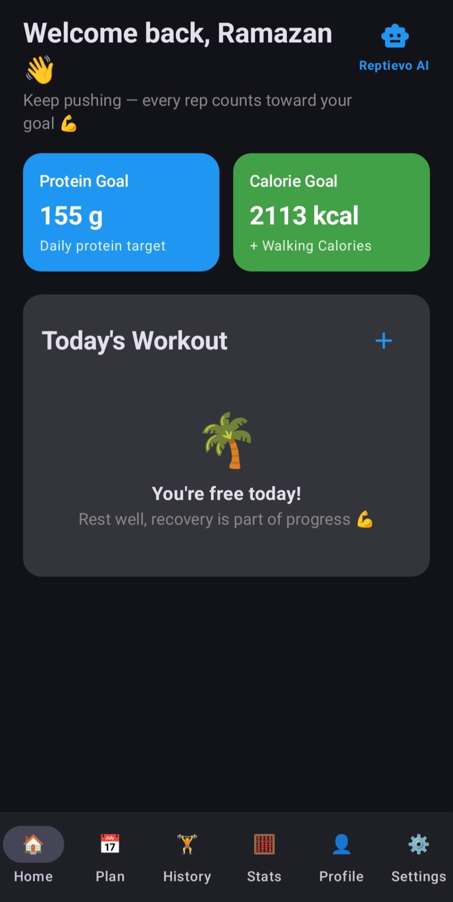
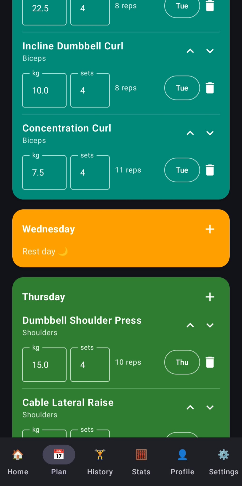
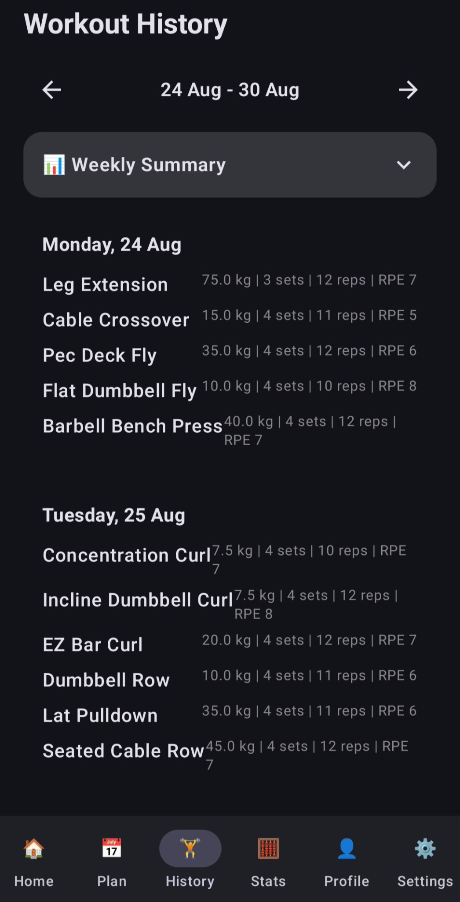
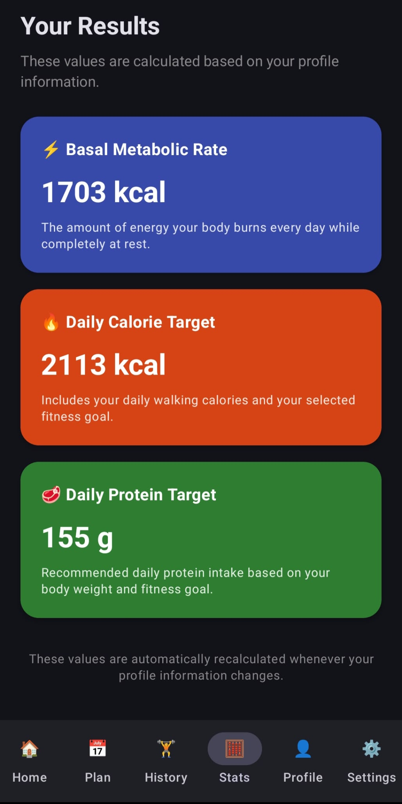
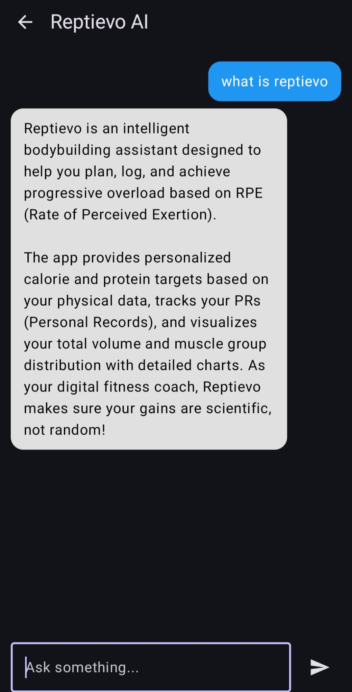

<p align="center">
  
</p>

<h1 align="center">Reptievo</h1>

<p align="center">
<b>Train Smarter. Lift Better.</b>
</p>

<p align="center">
Smart fitness companion built with Python, Kotlin, Supabase and AWS.
</p>

<p align="center">
<a href="https://play.google.com/store/apps/details?id=com.ramazanyuksel.liftiq">

</a>
</p>

<p align="center">
📱 <b>Available now on Google Play:</b>
<a href="https://play.google.com/store/apps/details?id=com.ramazanyuksel.liftiq">play.google.com/store/apps/details?id=com.ramazanyuksel.liftiq</a>
</p>

<p align="center">
<b>LinkedIn Company Page</b>
</p>

<p align="center">
<a href="https://www.linkedin.com/company/reptievo/?viewAsMember=true">linkedin.com/company/reptievo</a>
</p>

---

# Overview

Reptievo is a fitness assistant designed to remove the guesswork from strength training. Instead of manually calculating calories, protein intake, workout progression, and training volume, Reptievo automatically generates personalized workout plans and nutrition targets using a modern backend architecture.

The application combines native Android development with intelligent backend services to deliver a complete, end-to-end fitness companion — from onboarding to daily training to long-term progression.

---

## 📱 Screenshots

<p align="center">
  
  
  
  
  
</p>

<p align="center">
<i>Dashboard · Weekly Plan · Workout History · Stats · Reptievo AI</i>
</p>

---

## ✨ Features

### 🤖 Reptievo AI

Meet your pocket-sized digital fitness coach! Reptievo AI is integrated directly into the dashboard to guide your fitness journey and answer your questions.
* Powered by **Google Gemini 3.5 Flash Lite** for lightning-fast and highly accurate responses.
* Custom-trained via tailored context injection on the application's unique RPE philosophy, features, and mechanics.
* Provides instant help with app navigation, workout mechanics, hypertrophy science, and macro nutrition.
* Strictly stays in character — it won't answer non-fitness related prompts! 🛡️
* Rate-limited to 40 messages per user per day to ensure fair usage and service stability.
* Advanced RAG Integration: Employs Retrieval-Augmented Generation using a local embedding model (`all-mpnet-base-v2`) and Supabase pgvector.
* Dynamic Knowledge Base: Instantly retrieves highly accurate nutritional data from a seamlessly integrated database of 100+ food items, preventing AI hallucinations and providing precise macro advice.

### 🧭 Smart Onboarding

* Personalized user profile
* Body measurements (height, weight, age)
* Goal selection (bulk, cut, maintain)
* Experience level (beginner → advanced)
* Activity level

### 🍎 Nutrition Calculator

Automatically calculates:

* BMR (Basal Metabolic Rate)
* TDEE (Total Daily Energy Expenditure)
* Daily calorie target

### 🏋️ Intelligent Workout Planning

* Personalized weekly workout plans
* Beginner / Intermediate / Advanced support
* Equipment-aware weight generation
* Science-based exercise ratios

### 📈 Progressive Overload

Reptievo automatically adjusts training intensity based on:

* RPE (Rate of Perceived Exertion) score
* Previous workout performance
* Weight progression over time
* Full performance history

### 🧠 Smart Exercise Memory

When an exercise is swapped, removed, and later re-added to the plan, Reptievo doesn't reset it to a generic baseline. It intelligently restores progress in this priority order:

1. **Current plan** — if the exercise already exists elsewhere in your active plan, its weight/reps/sets are reused
2. **Workout history** — if not in the current plan, the most recent logged performance is used, with progressive overload applied
3. **Baseline calculation** — only if the exercise has never been performed, a fresh baseline is generated from body stats and experience level

### 📝 Workout Tracking

Track every session in detail:

* Exercises
* Sets & repetitions
* Weight
* RPE

### 🏃 Cardio Tracking

Log cardio sessions with MET-based calorie calculations:

* Treadmill walking & running (speed and incline aware)
* Stationary bike
* Elliptical, stair climber, and rowing machine
* Automatic calorie burn calculation based on body weight and duration

### 🔧 Workout Customization

* Reorder exercises
* Override weights, sets, and reps
* Swap exercises for tier-ranked alternatives (equipment-quality-based ordering)
* Add or remove exercises from any day
* Real-time synchronization with the backend

### 📊 Weekly Summary & Analytics

Reptievo automatically generates a detailed end-of-week breakdown to visualize your training progress. It compares your total weekly volume and completed sets against the previous week, calculating your exact volume progression with percentages. The summary automatically detects and highlights any new Personal Records (PRs) achieved during the week. Additionally, it features an 8-week volume trend line chart and a muscle group distribution bar chart to help you analyze exactly how much volume was allocated to each specific muscle group.

### 🧾 Non-Destructive Profile Updates

Editing your profile (weight, goal, activity level, etc.) recalculates your nutrition targets without wiping out your progressive overload history — your weight/reps progression on each exercise stays intact instead of resetting to baseline.

### 🌙 Recovery Detection

If no workout is scheduled for today, Reptievo automatically displays a Recovery Day, encouraging rest as part of the training cycle.

### ⏰ Smart Workout Reminder

A lightweight background worker checks your daily training status. If you have a workout scheduled for the day but haven't logged it by 22:00, Reptievo sends a gentle push notification to keep you accountable without being intrusive.

### 🌍 Multilingual Support

Fully localized interface supporting 8 languages out of the box:
* English
* Turkish
* German
* Spanish
* French
* Italian
* Portuguese
* Russian

Users can seamlessly switch languages on the fly without needing to restart the application.

### 🔒 Secure Communication

All traffic between the app and backend is encrypted end-to-end:

* Full HTTPS enforced via a free Let's Encrypt SSL certificate
* Nginx reverse proxy in front of the API with automatic HTTP → HTTPS redirection
* Certificates auto-renew, no manual maintenance required

### 🔄 Forced Update System

Reptievo checks the required minimum app version against the backend on every launch. If a device is running an outdated build, it's blocked with a full-screen prompt and redirected straight to the Google Play listing to update — ensuring all users stay on a consistent, supported version.

### 🔐 Seamless Session Handling

A proactive JWT refresh interceptor checks token expiry before every request and silently renews it in the background when needed. Users are never unexpectedly logged out mid-session, and a synchronized fallback mechanism prevents duplicate refresh calls when multiple requests fire at once.

### ⚙️ Account & Security

* Secure password change
* Email verification on signup with a custom branded confirmation page (instead of the default provider page)
* Token-based authentication with automatic rotation

---

## 🛠 Tech Stack

**Android**

* Kotlin
* Jetpack Compose
* Material 3
* Retrofit
* Coroutines
* DataStore

**Backend**

* Python
* FastAPI
* PostgreSQL
* Supabase (Auth + Database)
* Google Gemini 3.5 Flash Lite API (AI)

**Infrastructure**

* AWS EC2
* Nginx (reverse proxy)
* Let's Encrypt SSL (HTTPS)
* DuckDNS (dynamic DNS)
* Brevo (transactional email)
* GitHub Actions (CI/CD — automated deployment on every push to main)

---

## 🏗 Architecture

```text
Android App (Kotlin / Jetpack Compose)
              │
              ▼
   HTTPS (Nginx + Let's Encrypt)
              │
              ▼
     REST API (FastAPI)
              │
              ▼
   Supabase (Auth + PostgreSQL)
```

---

## ✅ Current Features

* Reptievo AI (Intelligent fitness assistant powered by Gemini 3.5 Flash Lite)
* Authentication & email verification (with custom branded confirmation page)
* User onboarding
* Nutrition calculator
* Baseline workout generator
* Progressive overload engine
* Smart exercise memory on re-add
* Cardio tracking with calorie calculation
* Workout history
* Exercise overrides & swaps (tier-ranked alternatives)
* Weekly summary & visual analytics (volume trends, muscle distribution)
* Automatic PR (Personal Record) tracking
* Recovery day detection
* Smart workout reminder (Sends a push notification at 22:00 if a workout is missed)
* Multilingual support (English, Turkish, German, Spanish, French, Italian, Portuguese, Russian)
* Non-destructive profile updates
* Profile management
* Secure password change
* HTTPS-secured API communication
* Seamless session handling (proactive token refresh)
* Forced update enforcement
* Automated CI/CD deployment

---

## 📄 Legal

* [Privacy Policy](./PRIVACY_POLICY.md)
* [Terms & Conditions](./TERMS_AND_CONDITIONS.md)
* [License](./LICENSE) — this project is proprietary software.

---

## 👤 Author

**Ramazan Yüksel**
Computer Engineering Student · Backend Developer · Android Developer

[GitHub](https://github.com/Ramazan-Yuksel) · [LinkedIn (Reptievo)](https://www.linkedin.com/company/reptievo/)